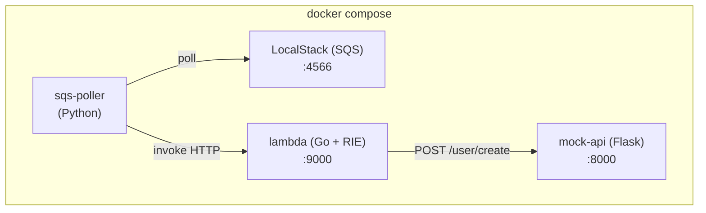

# go-local-aws-lambda-environment-test

Ambiente local completo para desenvolvimento e teste de uma **AWS Lambda escrita em Go** acionada por mensagens **SQS**, sem necessidade de conta AWS. Todo o ecossistema roda em Docker via `docker compose`.

---

## Visão geral da arquitetura



### Componentes

| Serviço | Tecnologia | Responsabilidade |
|---|---|---|
| `localstack` | LocalStack 3 | Emula o AWS SQS localmente |
| `lambda` | Go 1.22 + Lambda RIE | Processa mensagens SQS e chama a API de usuários |
| `mock-api` | Python / Flask | Simula o endpoint `POST /user/create` |
| `sqs-poller` | Python / boto3 | Faz polling na fila e aciona a Lambda via HTTP |

### Fluxo de execução

1. O **LocalStack** sobe e o script de init cria automaticamente a fila `lambda-queue`.
2. O **sqs-poller** aguarda a fila e a Lambda ficarem disponíveis e começa a fazer long-polling.
3. Ao receber mensagens, o poller monta um evento `SQSEvent` e envia via HTTP para a Lambda (Lambda Runtime Interface Emulator).
4. A **Lambda** desserializa o body YAML de cada mensagem e chama `POST /user/create` no **mock-api**.
5. Após invocação bem-sucedida, o poller deleta as mensagens da fila.

---

## Pré-requisitos

- [Docker](https://docs.docker.com/get-docker/) ≥ 24
- [Docker Compose](https://docs.docker.com/compose/) ≥ 2.20
- *(Opcional)* [AWS CLI](https://aws.amazon.com/cli/) para enviar mensagens manualmente

---

## Executando o ambiente

### 1. Subir todos os serviços

```bash
docker compose -f docker/docker-compose.yml up --build
```

Aguarde as seguintes mensagens nos logs antes de prosseguir:

```
localstack   | [init] Queue created.
lambda       | time="..." level=info msg="exec '/var/runtime/bootstrap' ..."
sqs-poller   | SQS queue is ready
sqs-poller   | Lambda RIE is ready
sqs-poller   | Poller started — polling http://localstack:4566/000000000000/lambda-queue
```

### 2. Enviar uma mensagem de teste

O body da mensagem deve ser um **YAML** com os campos `name` e `message`:

```bash
aws sqs send-message \
  --endpoint-url http://localhost:4566 \
  --queue-url http://localhost:4566/000000000000/lambda-queue \
  --message-body $'name: João\nmessage: Olá mundo' \
  --region us-east-1 \
  --no-cli-pager
```

> Sem o AWS CLI, é possível usar qualquer ferramenta capaz de fazer chamadas HTTP ao LocalStack (curl, Postman, boto3, etc.).

### 3. Verificar os logs

```bash
# Logs da Lambda (processamento da mensagem)
docker logs lambda -f

# Logs do mock-api (confirmação da chamada HTTP)
docker logs mock-api -f

# Logs do poller (poll e deleção da mensagem)
docker logs sqs-poller -f
```

Saída esperada na Lambda:

```
MessageId: <uuid>
Parsed payload — name: João | message: Olá mundo
Usuario cadastrado com sucesso. Status Code: 200
User created successfully for message <uuid>
```

### 4. Derrubar o ambiente

```bash
docker compose -f docker/docker-compose.yml down
```

---

## Estrutura do projeto

```
.
├── app/
│   ├── go.mod            # Módulo Go e dependências
│   ├── main.go           # Handler Lambda (lê SQS, parseia YAML)
│   └── user_service.go   # Serviço HTTP que chama o mock-api
└── docker/
    ├── docker-compose.yml
    ├── Dockerfile.lambda  # Build multi-stage: compila Go e empacota com Lambda RIE
    ├── init/
    │   └── 01-create-queue.sh  # Script de init do LocalStack (cria a fila)
    ├── mock-api/
    │   ├── app.py         # API Flask com endpoint POST /user/create
    │   └── Dockerfile
    └── poller/
        ├── poll.py        # Poller SQS → invocação da Lambda
        └── Dockerfile
```

---

## Variáveis de ambiente relevantes

| Variável | Serviço | Descrição |
|---|---|---|
| `USER_API_URL` | lambda | URL do endpoint de criação de usuários |
| `SQS_ENDPOINT` | sqs-poller | Endpoint do LocalStack |
| `SQS_QUEUE_URL` | sqs-poller | URL completa da fila SQS |
| `LAMBDA_ENDPOINT` | sqs-poller | Endpoint HTTP do Lambda RIE |
| `AWS_ACCESS_KEY_ID` / `AWS_SECRET_ACCESS_KEY` | sqs-poller | Credenciais fictícias para o LocalStack |

---

## Formato do payload

Cada mensagem enfileirada deve ter o body em **YAML**:

```yaml
name: Nome do usuário
message: Texto da mensagem
```

O campo `name` e `message` são encaminhados como JSON para o mock-api:

```json
{ "name": "Nome do usuário", "message": "Texto da mensagem" }
```
